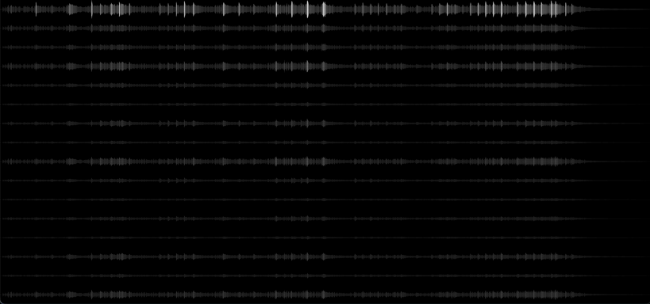

# A WebGPU multichannel audio waveform visualizer for HDR displays (SDR display compatible)

(This screencapture is an SDR preview)

### Why?
Today's displays can show both very dark and very bright levels, such as specular highlights.
Similarly, the human auditory and visual systems can handle huge dynamic ranges.

We can exploit this coincidence by mapping sound levels to brightness levels.  

The idea arose alongside an Ambisonics project.  
Let’s get started!

### How?
The visualizer uses a naive pre-generated binary format to carry information to the browser.
Two files contain peak and mean audio values. The data is a subset of the original audio data,
packed as interleaved float32 values.

### Prerequesites
- Python (see below)
- ffmpeg (required by the waveform render script)
- Node.js / npm (for running a local dev server)
- A WebGPU-capable browser (Chrome works best)

### Setup python environment
1. `$ pyenv install 3.13.5`
2. `$ python -m venv venv`
3. `$ source venv/bin/activate`
4. `$ pip install -U pip`
5. `$ pip install -r requirements.txt`

### Create *peak.bin* and *mean.bin*:
1. Use the test audio or put your own `*.caf` or `*.wav` file with up to 16 channels into `media/`
2. Run `$ python tools/render-waveform-binaries.py media/input.caf --output-dir=binaries`

### Serve it locally
WebGPU requires a secure context — however, browsers treat http://localhost & http://127.0.0.1 as secure contexts,
so a local HTTP server is fine.
1. `$ npm install http-server -g`
2. `$ npx http-server --cors -p 8888`
3. Open `127.0.0.1:8888`

That's it. :-)

--

This project is licensed under the MIT License.  
See the LICENSE file for details.  
